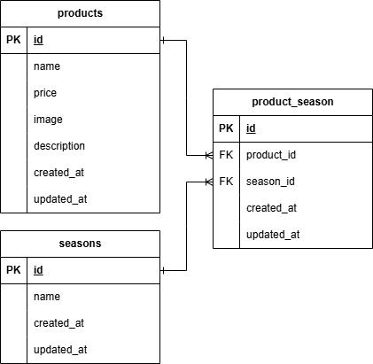

# 商品管理フォーム（mogitate）

## 環境構築

### Dockerビルド
1. `git clone git@github.com:takayuki345/mogitate.git`
2. DockerDesktopアプリを起動する
3. `docker compose up -d --build`

### Laravel環境構築
1. `docker compose exec php bash`
2. `composer install`
3. .env.exampleファイルから.envをコピー作成し、以下のように環境変数の値をメンテナンスする
``` text
DB_CONNECTION=mysql
DB_HOST=mysql
DB_PORT=3306
DB_DATABASE=laravel_db
DB_USERNAME=laravel_user
DB_PASSWORD=laravel_pass
```
4. アプリケーションキーの作成
``` bash
php artisan key:generate
```
5. マイグレーションの実行
``` bash
php artisan migrate
```
6. シーディングの実行
``` bash
php artisan db:seed
```

## 使用技術（実行環境）
- php 7.4.9
- Laravel 8.83.29
- Mysql 8.0.26

## ER図


## URL
- 開発環境：http://localhost/
- pypMyAdmin：http://localhost:8080/

## 備考
- 途中までの実装となっております